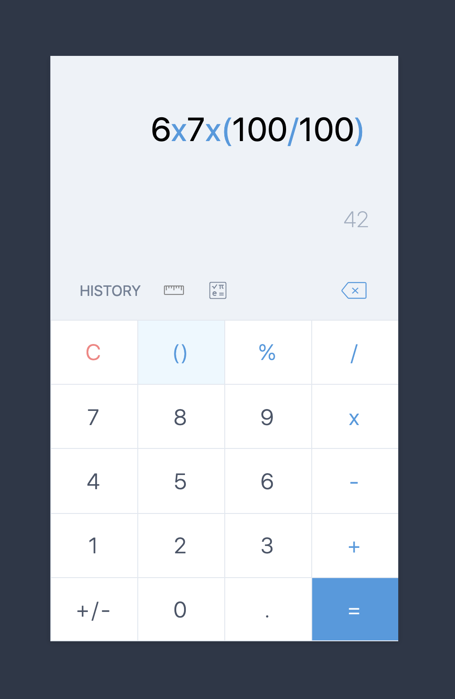

# Calc
The samsung calculator app recreated for the web. A showcase/playground for different JS frameworks and libraries.

Does simple calculations, handles parenthesis and has 0 dependencies outside of the base `create-react-app` deps for now.

## Roadmap

Frameworks
 - React
 - Vue
 - Svelte
 - RxJS
 - Next.js
 - Plain JS